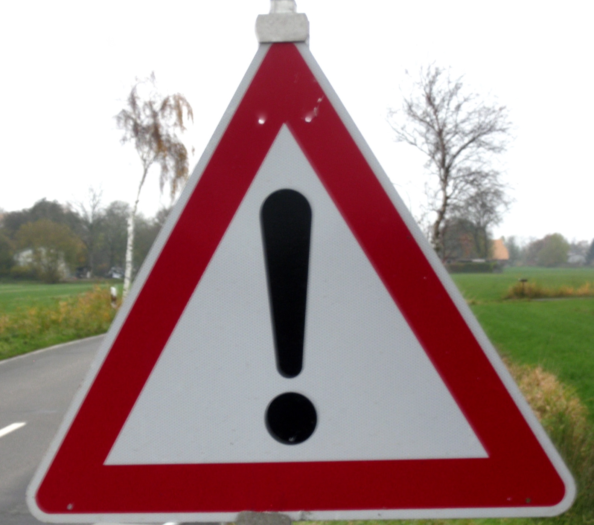
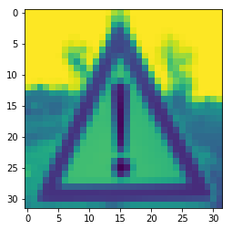
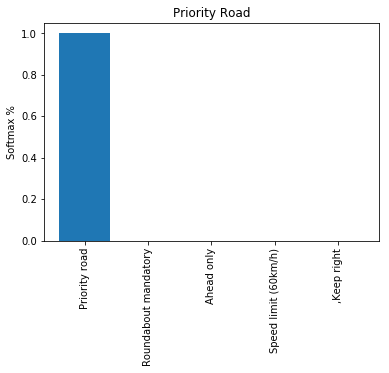
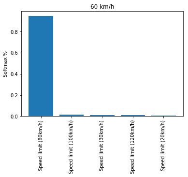

---
### Writeup / README

### Data Set Summary & Exploration

#### 1. Provide a basic summary of the data set. In the code, the analysis should be done using python, numpy and/or pandas methods rather than hardcoding results manually.

I used the python len(x) function in order to determine the size of the datasets. 
signs data set:

* The size of the orriginal training set is 34799
* The size of the augmented training set is 196673
* The size of the validation set is 4410
* The size of test set is 12630
* The shape of a traffic sign image before pre-processing is 32x32x3
* The shape of a traffic sign image after pre-processing is 32x32x1
* The number of unique classes/labels in the data set is 43

#### 2. Include an exploratory visualization of the dataset.

Here is an exploratory visualization of the data set. It is a bar chart showing the original data's sign image distribution, and the distribution after augmenting our training set.

### Design and Test a Model Architecture

#### 1. Describe how you preprocessed the image data. What techniques were chosen and why did you choose these techniques? Consider including images showing the output of each preprocessing technique. Pre-processing refers to techniques such as converting to grayscale, normalization, etc. (OPTIONAL: As described in the "Stand Out Suggestions" part of the rubric, if you generated additional data for training, describe why you decided to generate additional data, how you generated the data, and provide example images of the additional data. Then describe the characteristics of the augmented training set like number of images in the set, number of images for each class, etc.)

The techniques chose for preprossessing were Gray Scaling, Image Normalization, and boosting the number of images to process with affine image randomization. Additionally, the dataset was shuffled before fed into our trainer. Color Gradient processing similar to the lane lines project is planned for the future, though it will need to be tested further before implementing into a solution.

Gray scaling was performed in order to Grayscaling does reduce the total number of variables to consider. Intueitively, color seems useful as another possible neuron exciter, however, there is some evidence to suggested that networks perform better after grayscaling [Sermanet and LeCun](http://yann.lecun.com/exdb/publis/pdf/sermanet-ijcnn-11.pdf). A side by side test of with and without grayscaling on an identitical network architecture will be performed in the future, however due to time constraints it has not been tested yet.

Here is an example of a traffic sign image before and after grayscaling.

Image Normalizations was used in order to standardize the effect of our learning rate on our neurons weights. Without normalization, bright images and dull images would have vastly different pixel value ranges, which would cause issue when training scalar weight values to classify them.

Affine Image Bolstering was done in order to expand and normalize the data set, as well as to add images with different translations, rotations, and color contrasts to the data set. The Affine'ing function used was from [vxy10 - ImageAugmentation - Github](https://github.com/vxy10/ImageAugmentation). The training set was increased to ~5x it's orriginal size, with higher priority given to sign images with lower numbers of training images. The Pre and Post Augmentation images in the data summary and exploration show the sign class distribution before and after dataset augmentation.

Here is an example of an image before and after affine augmentation.

#### 2. Describe what your final model architecture looks like including model type, layers, layer sizes, connectivity, etc.) Consider including a diagram and/or table describing the final model.

My final model consisted of the following layers:

| Layer         		|     Description	        					| 
|:---------------------:|:---------------------------------------------:| 
| Input         		| 32x32x1 image    								| 
| Convolution 5x5     	| 1x1 stride, valid padding, outputs 28x28x32 	|
| RELU					|												|
| RELU					|												|
| Convolution 5x5     	| 1x1 stride, valid padding, outputs 24x24x32 	|
| RELU					|												|
| Fully connected   	| 18432x100    									|
| Fully connected x100	| 100x100      									|
| Output            	| 100x43 classes 								|
| Softmax				| with cross entropy and one hot logits			|
| Reduce Mean			|												|
| Adam Optimizer		| Learning rate of 0.001						|
 

#### 3. Describe how you trained your model. The discussion can include the type of optimizer, the batch size, number of epochs and any hyperparameters such as learning rate.

The [AdamOptimizer](https://arxiv.org/abs/1412.6980) was chosen due to it's effectiveness on non-stationary images with high noise, and it's hyperparamteres requiring little tuning. It was also chosen due to it's higher performance over [AdadeltaOptimizer](https://arxiv.org/abs/1212.5701) and [ProximalGradientDescentOptimizer](http://papers.nips.cc/paper/3793-efficient-learning-using-forward-backward-splitting.pdf) when run in test trials. The adamoptimizer proved to indeed be resiliant to changes in hyper paramters, though many attempts to change the learning rate value away from the document suggested value of .001 cuased a drop in performance.

Our batch size was left at 128, as a higher number of batch size seemed to correlate negatively with our accuracy. This is possibly due to the frequency of weight variables being updated, with a higher frequency with a lower batch size, thus causing more granular neural adaption.

Ten epochs were imployed. It appears a slight increase may be gainined by further epochs, however, long training times discouraged attempts beyond 10. Hyper parameters were changed frequently, however after many attempts they were returned to the values utilized in the LeNet lab.

#### 4. Describe the approach taken for finding a solution and getting the validation set accuracy to be at least 0.93. Include in the discussion the results on the training, validation and test sets and where in the code these were calculated. Your approach may have been an iterative process, in which case, outline the steps you took to get to the final solution and why you chose those steps. Perhaps your solution involved an already well known implementation or architecture. In this case, discuss why you think the architecture is suitable for the current problem.

My final model results were: (as per Traffic_Sign_Classifier_Run-Final.html)
* training set accuracy of 98.3% in 180s 
* validation set accuracy of 94.6% in 3.9s
* test set accuracy of 90.9% in 11.6s
* Internet sign test accuracy of 60% in < 1s
* As evident from these results, there is a large amount of overfitting to the training set.

The following approach was used in order to achieve our results, with our base architecture revolving around the LeNet network

Try initial LeNet Setup : Not accurate enough
1. Tune hyper perameters
    - Learning rate, batch size, epochs 
    - Decreased accuracy or added much training time for little benefit.
    - Took a long time to train (400s)
2. Perform Literature Search
    - http://yann.lecun.com/exdb/publis/pdf/sermanet-ijcnn-11.pdf
    - https://stats.stackexchange.com/questions/181/how-to-choose-the-number-of-hidden-layers-and-nodes-in-a-feedforward-neural-netw
    - https://www.tensorflow.org/api_guides/python/train#Optimizers
        - https://arxiv.org/abs/1412.6980
    - those listed above proved to be the most helpful
3. Tune layer size
    - Only decreased accuracy
    - Took longer to train (800s - 8000s)
4. Convert Images to Grayscale
    - Moderate performance increase. 
    - Retested layer size tuning
5. Tune layer architecture
    - Decreased Accuracy
6. Speak with mentor
    - Focused on preproccessing afterwards
    - Normalized images (I realized how important this step was)
    - performed affine image augmentation and boosted size of database
7. Re-Attempt orriginal LeNet Architecture
    - Worked much better with highly preprocessed data
    - Tuned Layer size
    - Tuned Layer architecture
    - Hit requirements
8. Future Improvements
    - Modify pooling
    - Attempt dropout
    - Attempt without greyscale
    - Attempt without color modification for affine augmetnation

The LeNet architecture was chosen for this problem due to the success and quick training times aprrently achieved in the UDACity project video. Knowing that a quick and high accuracy solution could be achieved with this architecture, it formed the starting point for most expirements. Additionally, the LeNet implemnetation is very similar in architecture to that proposed by [Sermanet and LeCun](http://yann.lecun.com/exdb/publis/pdf/sermanet-ijcnn-11.pdf) where an accuracy of 98.81% was achieved.

Unfortunately the model did not perform well on the test set of 5 images from the web (60% accuracy), although, the model did perform relatively well on the validation set (94.5%). As such the LeNet network model seems a suitable place to start for further investigation. Most of the large improvements in accuracy that were observable were derived from changes in the training set, and not in changes from the architecture.

 

### Test a Model on New Images

#### 1. Choose five German traffic signs found on the web and provide them in the report. For each image, discuss what quality or qualities might be difficult to classify.

Here are five German traffic signs that I found on the web:

##### Un-preproccessed
 
 
 
 

##### Pre-processed

 
 
 
 

These signs were orriginally in high quality images with some background scenery. After pre-processing the images to remove background scenery, and reduce image size through interpolation the images seemed to be easy to classify. The processed images contain very little background are easy to identify with the human eye.

 * 1 : The first image is came out suprisingly well after post processing, though it does contain many similarities with other signs such as a circular boarder, an inside and outside color shade patern, and many diagonal lines inside the inner circle of the sign.
 * 2 : The second image is one of the more unique images, as it has a triangular border and a vertical solid line in the center.
 * 3 : The third image shares a rectagonal shape with many other signs, and has a series of diagonal lines in its middle which may trigger false activations.
 * 4 : The fourth image might be difficult to classify due to the shape of the 6 in the image. The 6 has a diagonal line on top and a circle on the bottom. These edges are shared by many many other signs, and could trigger a false activation of neurons during classification.
 * 5 : The final image might be difficult to classify due to the lack of definitive boarder around the edges once the image that occured during processing. Due to the interpolation of the image to reduce size, the clear octogonal edge pattern of the sign has bled into a somewhat circular pattern. additionally, the grayscaling of the image would further reduce distinguishing patters of White Lettering on Red Sign.

#### 2. Discuss the model's predictions on these new traffic signs and compare the results to predicting on the test set. At a minimum, discuss what the predictions were, the accuracy on these new predictions, and compare the accuracy to the accuracy on the test set (OPTIONAL: Discuss the results in more detail as described in the "Stand Out Suggestions" part of the rubric).

Here are the results of the prediction:

| Image			        |     Prediction	        					| 
|:---------------------:|:---------------------------------------------:| 
| 70 km/h       		| 70 km/h   									| 
| General Caution		| General Caution								|
| Priority Road			| Priority Road									|
| 60 km/h	      		| Roundabout Mandatory			 				|
| Stop Sign 			| Go straight or right 							|

The model was able to correctly guess 3 of the 5 traffic signs, which gives an accuracy of 60%. This not desirable for application.

The model performed very well for the first 3 images, the 70km, general caution, and priority road, however, The classifier failed to correctly identify the stop sign, or the 60 km sign. Clearly this is due to the machine algorithm having little respect for local traffic enforcement and wanting to travel only at speeds 70+ km and stopping for nothing in it's tracks. A more likely cause would be due to the small amount of variability between some styles of signs at low resolutions, and weights not being able to differentiate well enough. The accuracy of our new images was much lower than the accuracy of our training set. I was very surprised that the stopsign was misclassified, however after looking at the post-modified image the outline boarder of the sign was very blurred it could appear similar to the a circular sign. This is a situation where color likely would have added to the accuracy of classifying the image rather than detracted.

#### 3. Describe how certain the model is when predicting on each of the five new images by looking at the softmax probabilities for each prediction. Provide the top 5 softmax probabilities for each image along with the sign type of each probability. (OPTIONAL: as described in the "Stand Out Suggestions" part of the rubric, visualizations can also be provided such as bar charts)

The code for making predictions on my final model is located in the 11th cell of the Ipython notebook. (As softmax results differed greatly between individual training sessions, the results discussed herea re those found in Run-1.html)

The probabilities for each of the signs ranged vastly, with the highest probability reaching 59%, and the lowest classified certainty being at 27.3%. The largest gap between a singles sign's first and second softmax probabilities was 19%, while the smallest was ~3.5%.

##### Image 1 - 70 km/h sign
* For the first image, the model achieves a correct classifcation, however it is not very certain, with a margin of only 4% between the first and second softmax probabilities.

| Probability         	|     Prediction	        					| 
|:---------------------:|:---------------------------------------------:| 
| .273         			| 70 km/h   									| 
| .235     				| Double Curve									|
| .189					| Wild Animal Crossing							|
| .182	      			| Road narrows on the right		 				|
| .175				    | General Caution      							|

##### Image 2 - General Caution Sign
*The second image had the highest certainty of the test group, with a softmax probability of 59%, and had a correct classification.

| Probability         	|     Prediction	        					| 
|:---------------------:|:---------------------------------------------:| 
| .59         			| General Caution   							| 
| .403     				| Road narrows on the right 					|
| .402					| Double curve									|
| .388	      			| Traffic Signals					 			|
| .367				    | Bicycles crossing      						|

##### Image 3 - Priority Road sign
* The third sign had a correct classification, and was resonably certain of it's prediction compared to other classifications.

| Probability         	|     Prediction	        					| 
|:---------------------:|:---------------------------------------------:| 
| .394         			| Priority Road   								| 
| .226     				| Roundabout Mandatory							|
| .197					| Right-of-way at the next intersection			|
| .196	      			| Keep right             		 				|
| .191				    | 50 km/h           							|

##### Image 4 - 60 km/h sign
* The fourth sign had an incorrect classification with a small spread within the top 5 probabilities. The third probability of 24.1% was the correct classification for this sign, though the margin of certainty was very close to that of the 1st sign (70 km/h).
*The prediction however was rather inclined to believe that the sign was a speed limit sign. For this example, a technique other than one hot encoding may be advantageous.  

| Probability         	|     Prediction	        					| 
|:---------------------:|:---------------------------------------------:| 
| .284         			| Roundabout Mandatory   						| 
| .249     				| 30 km/h						     			|
| .242					| 60 km/h						            	|
| .219	      			| End of 80 km/h		 		          		|
| .207				    | 20 km/h      					         		|

##### Image 5 - Stop Sign
* The final sign had an incorrect classification and a relatively high certainty of 42.8% for the first softmax probability, The second probability coming in at 30.5% and was the correct classification for the sign. This 1st-2nd gap of ~12% points suggests that the preprocessing performed on the image individual image might have destroyed some of the key indicators for that particular image. 

| Probability         	|     Prediction	        					| 
|:---------------------:|:---------------------------------------------:| 
| .428         			| Go straight or right   						| 
| .304     				| Stop				        					|
| .303					| No Entry			             				|
| .294	      			| Keep right		             				|
| .28				    | Priority road      							|

##### Softmax Summary:

The softmax probabilities revealed that the 40% incorrect answers had the correct answer within the top 3 probabilities.  The highest probability for the 70km sign was 27%, which was correct, though the second most likely answer follwed very closely with 23.5%. The highest certainty achieved was 59% for the General Caution Sign with the second softmax probability for that sign being 40%, which is also the largest gap (19%) between first and second softmax probabilities. The second highest gap and second highest probability for a correct answer was for the priority road sign, achieving 39.4% first softmax probability and a second probability of 22.6% for a gap of ~17%.

